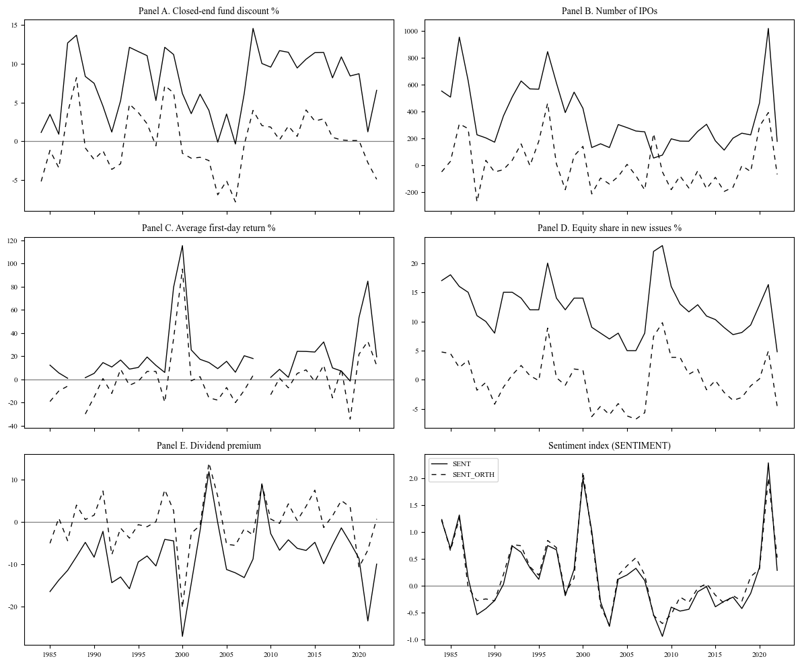
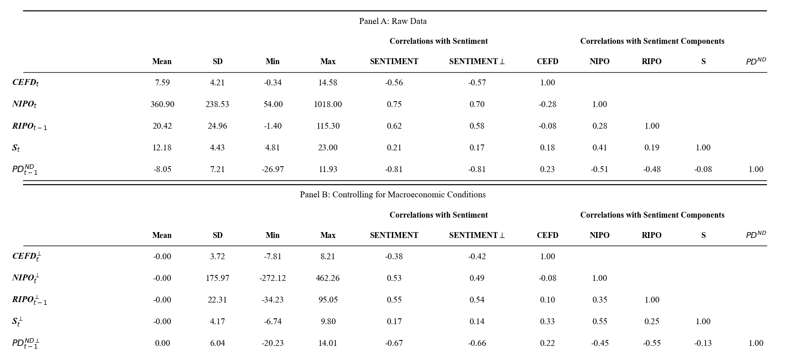
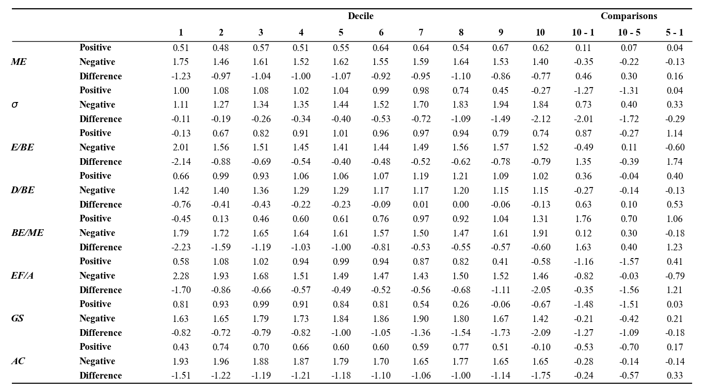
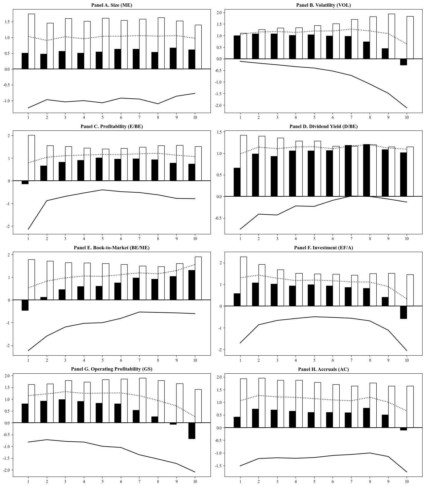
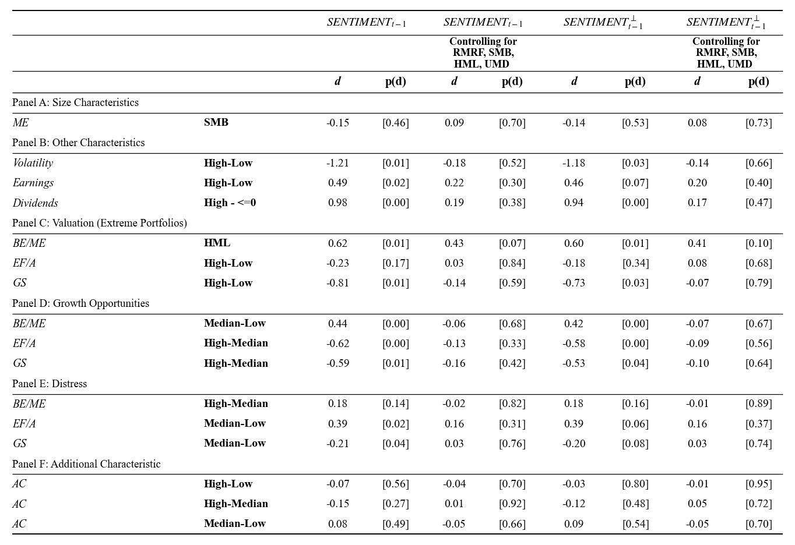
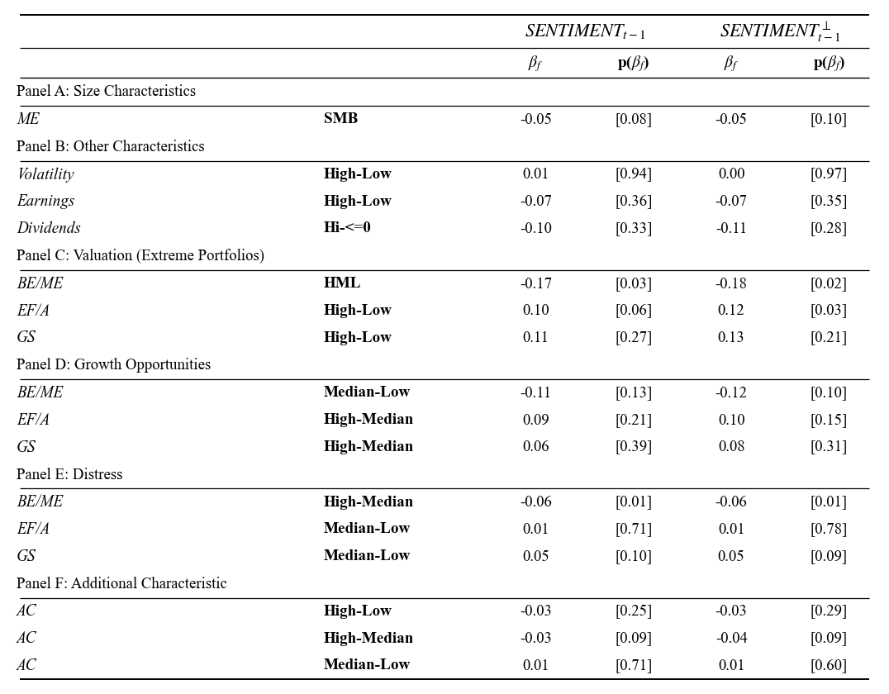
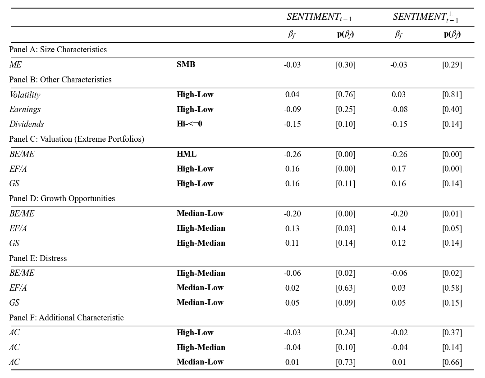

# Investor Sentiment

## Overview
This project replicates and extends an empirical asset pricing study on investor sentiment and cross-sectional stock returns.

**Key components:**
- Replication of characteristic-based return predictability
- Exploratory extension using an additional characteristic (AC)
- Evaluated robustness using higher-frequency sentiment measures (anuual vs monthly)
- Tested whether sentiment-driven effects persist in more efficient, modern market environments

## Procedure

### 1. Sorts & Plots
(Table 2) For each month, stocks are sorted into 10 equally-weighted portfolios based on NYSE decile breakpoints across 8 key characteristics (ME, Vol, Prof, DY, BE/ME, Inv, NI, AC)  
(Figure 2) shows the results of Table 2 graphically  
- Returns are compared across positive and negative Orthogonalized Sentiment ($SENTIMENT^\perp$)
- Identify time-series changes in cross-sectional effects from the conditional difference of average returns across deciles

**additional characteristc**
- AC (accruals): High/Low AC indicates higher cash flow uncertainty; may capture U-shaped patterns (hard to value & arbitrage)

### 2. Predictability Regressions
$$
\begin{aligned}
R_{X_{it=High},t} - R_{X_{it=Low},t} = c + d SENTIMENT_{t-1} + \beta RMRF_t + s SMB_t + h HML_t + m UMD_t + u_t 
\end{aligned}
$$  

(Table 3) The monthly returns from January through December of t are regressed on the sentiment index that prevailed at the end of the prior year
- Exclude SMB and HML from the right side when they are the portfolios being forecast
- Dependent variable: monthly return on a long–short portfolio
- Due to data limatations, portfolio breakpoints vary across characteristics:
  - (30/40/30): profitability(earn), BEME, INV(E/FA), DY
  - (20/60/20): volatility, NI(GS), AC, while med60 = (Qnt2+Qnt3+Qnt4)/3
- Four model variations are evaluated :
  - Orthogonalization: Raw vs. Orthogonalized
  - Factor Control: With vs. Without 4-factor

### 3. Interaction Effects
$$
\begin{aligned}
RX_{it=\text{High}, t} - RX_{it=\text{Low}, t} = c + d \cdot \text{SENTIMENT}_{t-1} + \beta (e + f \cdot \text{SENTIMENT}_{t-1}) \text{RMRF}_t + u_t 
\end{aligned}
$$  

(Table 4) Investigate whether sentiment coincides with time variation in market betas
- Hypothesis Testing:
  - Risk Hypothesis: The sign of $\beta f$ is consistent with the return prediction coefficient from Table 3. This confirms that Beta risk captures the return dynamics
  - Sentiment Hypothesis: The sign of $\beta f$ is either inconsistent (wrong sign) or statistically insignificant
- Average monthly returns are matched to SENTIMENT from the previous year-end

### 4. Monthly Sentiment
(Table 5) We re-estimate the interaction regressions from the previous table using monthly sentiment
- The original study uses annual sentiment, based on the idea that sentiment affects returns slowly over time
- As financial markets have become faster and more responsive, sentiment may also have more short-term effects

## Results

### Figure 1 – Sentiment Proxies
- Solid line: Raw data. Dashed line: Regression residuals (orthogonalized to remove macroeconomic factors)  

### Table 1 – Summary Statistics
- Left: Descriptive statistics of the 5 sentiment proxies
- Right: Correlation matrix
- Top/Bottom: Comparison before and after removing macroeconomic influences (orthogonalization).  

### Table 2 – Portfolio Returns by Sentiment

### Figure 2 – Decile Portfolio Returns
- X-axis: decile 1-10, Y-axis: average monthly return
- Solid bars: average monthly return in high sentiment periods
- clear bars: average monthly return in low sentiment periods
- solid lines: the difference in both periods
- dashed lines: the average in both periods  

### Table 3

### Table 4

### Table 5
- The transition to Monthly Sentiment (Table 5) reveals much stronger interaction effects. This suggests that in the modern era, sentiment is a high-turnover signal

## Key Findings
- Sentiment-driven mispricing remains significant in the modern market, particularly for "hard-to-value" stocks (High Volatility, Low Profitability)
- Transitioning from Annual to Monthly sentiment significantly improves statistical significance ($p < 0.01$ for BE/ME and EF/A), suggesting that sentiment shocks now propagate through markets much faster than in the original 1963-2001 sample
- Extension (Accruals): While AC show visual sensitivity to sentiment shifts, they exhibit lower beta-interaction significance, suggesting AC may capture idiosyncratic risks rather than systematic sentiment-driven beta shifts

## Data
- Portfolio returns sorted on firm characteristics
- Fama-French 3 factors + momentum factor (UMD)  
- Investor Sentiment data  

**Source:**
1. Kenneth R. French - Data Library
2. [Professor Jeffrey Wurgler's website](https://pages.stern.nyu.edu/~jwurgler/)  

**Time Period:** 1984 to 2022

## Reference
Baker, M., & Wurgler, J. (2006). Investor sentiment and the cross-section of stock returns. The Journal of Finance, 61(4), 1645–1680